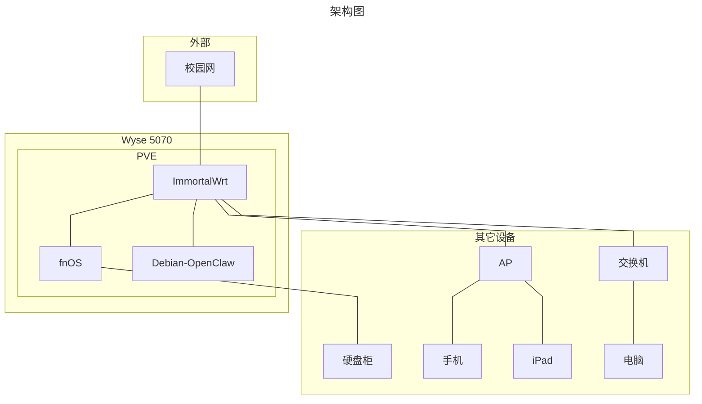

<!--more-->

## 一切的起因

得益于尼禄优秀的校园网机制，每次联网都要跳转网页认证，ip还会不定时改变，导致远程连接宿舍电脑变得极其麻烦。为了省去认证步骤以及每次出门前开电脑记ip的麻烦，我就打算弄台openwrt软路由。一如既往，我的脑子又开始意淫：既然有了小主机，为什么不跑docker，为什么不做nas，为什么不玩IoT……

## 硬件选择

我的这台主机是J5005高配版，胖版的机箱空间更大，但是没有瘦版的emmc。
Wyse 5070只有一个千兆网口，为了跑软路由，我把M.2 WiFi口转成了RTL8125BG 2.5G网口（M.2 A+E key）。
另外还有一个M.2插槽，我本想那它拓展出几个sata盘位，等转接卡到了我才发现这个M.2接口**不支持NVME协议**，只能纯物理方法转接为单个sata口。我找了半天才找到卖**ngff转sata转接卡**的（自带供电，不错）
内存方面，主板带有两个ddr4插槽，本来官网上写的这颗cpu最高只支持8G内存，但实测更新完bios（1.40）后可以识别16G+8G内存。
硬盘用的是二手淘的三星企业级PM863 120g。
主板上还有一个PCIe x4插槽（只有胖版主机焊了），我用一张hba扩展出两个ssf-8087口连接DKSTUDIO大佬的6盘位硬盘柜。

## 系统架构
这套硬件对我来说性能已经有些过剩了，为了方便管理以及降低all in boom的风险，我选择Proxmox VE作为宿主系统，用虚拟机跑ImmortalWrt负责网络管理，fnOS用来提供nas服务以及搭载docker，我还建了一个Debian虚拟机来跑最近很火的OpenClaw。

## 使用体验

局域网内能跑满千兆带宽，还是比较稳定的。
通过设置端口转发，可以在图书馆用moonlight远程连接宿舍的pc。
将核显直通给fnOS，在Jellyfin里开启硬件解码，J5005核显虽然不咋样，但播放4k电影还是没问题的。
NAS专用系统还是太方便了，备份、快照、同步都能一键设置。
在fnOS里我利用AstrBot和NapCat挂了个qq聊天机器人，潜伏在学校的车万群。
至于IoT部分，就等以后再折腾吧

## 一些碎碎念

- 内存核硬盘涨价太疯了，导购我阐述你的梦。
- 其实升级bios时翻车了，差点变砖，还好Gemini大人提醒我可以用Dell官方的bios修复工具。
- 我最初的想法是在本地部署qwen2.5 3b的，结果发现0.2tok/s的速度都跑不到，无奈只能用API了。
